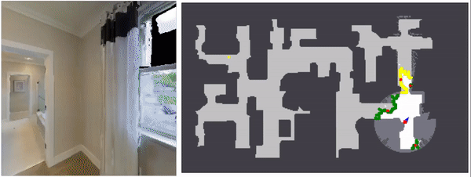

# Comparison of Model Free and Model-Based Learning-Informed Planning for PointGoal Navigation
This is the code release for our CoRL 2022 Long Horizon Planning Workshop paper:

[Comparison of Model Free and Model-Based Learning-Informed Planning for PointGoal Navigation](https://arxiv.org/pdf/2212.08801.pdf)<br/>
Yimeng Li*, Arnab Debnath*, Gregory J. Stein, Jana Kosecka<br/>
George Mason University

Project website: [https://yimengli46.github.io/Projects/CoRL2022LHPWorkshop/index.html](https://yimengli46.github.io/Projects/CoRL2022LHPWorkshop/index.html)



```bibtex
@inproceedings{li2022comparison,
  title={Comparison of Model Free and Model-Based Learning-Informed Planning for PointGoal Navigation},
  author={Li, Yimeng and Debnath, Arnab and Stein, Gregory J and Kosecka, Jana},
  booktitle={CoRL 2022 Workshop on Learning, Perception, and Abstraction for Long-Horizon Planning}
}
```

### Installation
```
git clone --branch main https://github.com/yimengli46/bellman_point_goal.git
cd  bellman_point_goal
mkdir output
```
### Dependencies
We use `python==3.7.4`.  
We recommend using a conda environment.  
```
conda create --name lsp_habitat python=3.7.4
source activate lsp_habitat
```
You can install Habitat-Lab and Habitat-Sim following guidance from [here](https://github.com/facebookresearch/habitat-lab "here").  
We recommend to install Habitat-Lab and Habitat-Sim from the source code.  
We use `habitat==0.2.1` and `habitat_sim==0.2.1`.  
Use the following commands to set it up:  
```
# install habitat-lab
git clone --branch stable https://github.com/facebookresearch/habitat-lab.git
cd habitat-lab
git checkout tags/v0.2.1
pip install -e .

# install habitat-sim
git clone --recurse --branch stable https://github.com/facebookresearch/habitat-sim.git
cd habitat-sim
pip install -r requirements.txt
sudo apt-get update || true
# These are fairly ubiquitous packages and your system likely has them already,
# but if not, let's get the essentials for EGL support:
sudo apt-get install -y --no-install-recommends \
     libjpeg-dev libglm-dev libgl1-mesa-glx libegl1-mesa-dev mesa-utils xorg-dev freeglut3-dev
git checkout tags/v0.2.1
python setup.py install --with-cuda
```
You also need to install the dependencies:  
```
habitat==0.2.1
habitat-sim==0.2.1
torch==1.8.0
torchvision==0.9.0
matplotlib==3.3.4
networkx==2.6.3
scikit-fmm==2022.3.26
scikit-image
sknw
tensorboardX
```
To install lsp-accel, first install [Eigen](https://eigen.tuxfamily.org/dox/GettingStarted.html "Eigen").   
Then change `line 30` of `lsp_accel/CMakeLists.txt` into where *Eigen* folder is located.
```
pip install lsp_accel
```

### Dataset Setup
Download *scene* dataset of **Matterport3D(MP3D)** from [here](https://github.com/facebookresearch/habitat-lab/blob/main/DATASETS.md "here").      
Upzip the scene data and put it under `habitat-lab/data/scene_datasets/mp3d`.  
You are also suggested to download *task* dataset of **Point goal Navigation on MP3D** from [here](https://github.com/facebookresearch/habitat-lab/blob/main/DATASETS.md "here")  
Unzip the episode data and put it under `habitat-lab/data/datasets/pointnav/mp3d`.  
Create softlinks to the data.  
```
cd  bellman_point_goal
ln -s habitat-lab/data data
```
The code requires the datasets in data folder in the following format:
```
habitat-lab/data
                /datasets/pointnav/mp3d/v1
                                        /train
                                        /val
                                        /test
                scene_datasets/mp3d
                                    /1LXtFkjw3qL
                                    /1pXnuDYAj8r
                                    /....
```

### How to Run?
The code can do  
(a) Point Goal Navigation on MP3D test episodes.   
All the parameters are controlled by the configuration file `core/config.py`.   
Please create a new configuration file when you initialize a new task and saved in folder `configs`.
##### Exploring the environment
To run the large-scale evaluation, you need to download pre-generated `scene_maps`, `scene_floor_heights`, `large_scale_semantic_maps` and `point_goal_episodes` from [here](https://drive.google.com/file/d/1wRg9QjNZcLPMdJdWIu9tZLOPTWe-JDd7/view?usp=sharing "here").  
Download it, unzip it and put the folders under `bellman_point_goal/output`.  
Then you can start the evaluation.  
For example, if you want to evaluate the optimistic planner on your desktop, use the following command.  
```
python main_eval.py --config='exp_90degree_Optimistic_PCDHEIGHT_MAP_1STEP_500STEPS.yaml'
```
If you have a server with multiple GPUs, use another configuration file.
```
python main_eval_multiprocess.py --config='large_exp_90degree_Optimistic_PCDHEIGHT_MAP_1STEP_500STEPS.yaml'
```

### Train the learning modules
##### Generate training data
To generate training data, run the following command:   
```
python data_generator_for_point_goal.py --j=1
```
You can customize the training hyperparameters using the configuration file `exp_train_input_partial_map_occ_and_sem_for_pointgoal.yaml`.        
Here are a few key options:     
* Set the `SPLIT` parameter to either `train` or `val` to generate data for training or validation scenes.
* Adjust `PRED.PARTIAL_MAP.multiprocessing` to `single` or mp for single-threaded or multithreaded generation, respectively.
